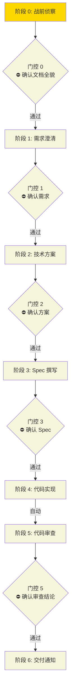

## 执行进度

> Loop 计数：0 / 3

> 回退发生时：在 G5 与目标阶段之间添加虚线回退边 `G5 -.->|"不通过"| S{N}`，并更新 Loop 计数。

颜色约定：
- 🟢 `#90EE90` 绿色 = 已完成
- 🟡 `#FFD700` 黄色 = 进行中
- ⚪ `#F5F5DC` 米色 = 待执行
- 🔴 `#FFB6C1` 浅红 = 阻塞/退回

门控节点（菱形）与阶段节点使用相同颜色规则。通过后变绿，当前门控变黄，未到达保持米色。

## 阶段记录

| 阶段 | 状态 | 次数 | 开始时间 | 完成时间 | 备注 |
|------|------|------|----------|----------|------|
| 0 战前侦察 | 🟡 进行中 | 1 | {{CREATED_AT}} | - | - |
| 门控 0 | ⚪ 待确认 | - | - | - | 确认文档全貌 |
| 1 需求澄清 | ⚪ 待执行 | 0 | - | - | - |
| 门控 1 | ⚪ 待确认 | - | - | - | 确认需求 |
| 2 技术方案 | ⚪ 待执行 | 0 | - | - | - |
| 门控 2 | ⚪ 待确认 | - | - | - | 确认方案 |
| 3 Spec | ⚪ 待执行 | 0 | - | - | - |
| 门控 3 | ⚪ 待确认 | - | - | - | 确认 Spec |
| 4 实现 | ⚪ 待执行 | 0 | - | - | 完成后自动进入审查 |
| 5 审查 | ⚪ 待执行 | 0 | - | - | - |
| 门控 5 | ⚪ 待确认 | - | - | - | 确认审查结论 |
| 6 交付 | ⚪ 待执行 | 0 | - | - | - |

## 门控审核记录

| 门控 | 确认时间 | 确认信号 | 审核结论 |
|------|----------|----------|----------|
| 门控 0 | - | - | 待确认 |
| 门控 1 | - | - | 待确认 |
| 门控 2 | - | - | 待确认 |
| 门控 3 | - | - | 待确认 |
| 门控 5 | - | - | 待确认 |

## 文档索引

| 文档 | 路径 | 状态 |
|------|------|------|
| 需求确认单 | .claude/tasks/{{TASK_NAME}}/需求确认单.md | ⚪ |
| 技术方案 | .claude/tasks/{{TASK_NAME}}/技术方案.md | ⚪ |
| 接口协议 | .claude/tasks/{{TASK_NAME}}/接口协议.md | ⚪ |
| Spec | .claude/tasks/{{TASK_NAME}}/spec/ | ⚪ |
| 审查报告 | .claude/tasks/{{TASK_NAME}}/审查报告.md | ⚪ |
| 交付通知 | .claude/tasks/{{TASK_NAME}}/交付通知.md | ⚪ |
| 重试记录 | .claude/tasks/{{TASK_NAME}}/重试记录.md | ⚪ |

## 重试记录

| 循环 | 时间 | 从阶段 | 打回阶段 | 原因 |
|------|------|--------|----------|------|
| - | - | - | - | 暂无回退 |

## 变更记录

| 时间 | 变更内容 |
|------|----------|
| {{CREATED_AT}} | 阶段 0 战前侦察完成，创建任务 |
